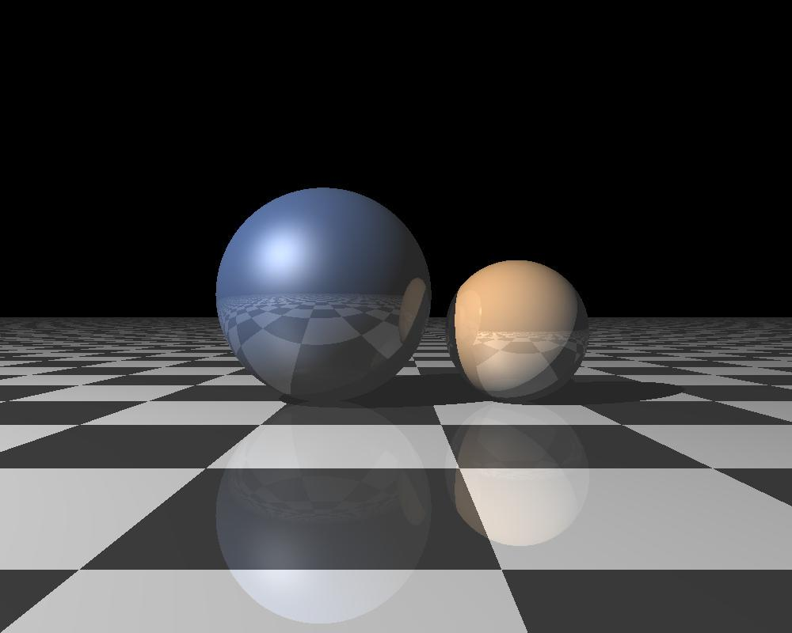

# Simple Ray Tracing

## 1. 简介
    大学时参照虎书实现的光线跟踪算法。
    只支持灰度图片渲染，后经脚本合成RGB通道获得彩色图片。

    折射开发时存在问题(搁置)

## 2. 代码结构
    ./          --功能类和render逻辑
        ./pic   --main.py图片输出目录

## 3. 运行(Run)
    python3 main.py         --主渲染逻辑(灰度图片)
    python3 merge_script.py --合成彩色图片

## 4. 依赖
    numpy、pillow