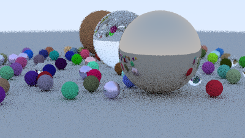

# Ray Tracing In One Weekend （Python+Multiprocess）

## 1. 简介
    这是一个光线跟踪算法的入门项目，使用python从0实现基本的ray tracing算法。主要包括了 向量计算库、相机、碰撞几何体、材质 等类的实现。

    notebook目录对所有代码进行了整合，更接近原参考教材的实现步骤。读者可以边参考原文边运行对应的python代码，即时获得当前阶段的图片效果。
    
    由于python的效率问题，进行了多线程改写，并缩小了部分参数规模。最终渲染效果见上图。

* 参考教程: [RayTracingInOneWeekend](https://raytracing.github.io/books/RayTracingInOneWeekend.html)

## 2. 代码结构
    ./  --主代码（涵盖所有功能类和render逻辑）
        ./docs      --numpy矩阵计算的实现思路(可以参考)
        ./images    --main.py图片输出目录
        ./notebook  --代码汇总版本（可单独运行）
        ./tests     --测试

## 3. 运行(Run)
    notebook版本(推荐) 
        点击运行即可

    python项目版
        根目录下运行 python3 main.py
        注：相机参数和场景设定写死在main.py中，可通过flag切换多个场景。

## 4. 依赖
    tqdm、numpy、pillow

## 5. 总结与心得：
    * 由于python的效率问题，不建议后续课程在本项目基础上继续开发。
    * 对于不熟悉C++和环境配置的读者来说，本项目的notebook兼具简单和直观的优点，很适合入门学习使用。最终图片效果和计算效率也可以接受。
    * [TODO] docs/raytrac_weekend_numpy.ipynb使用了numpy矩阵计算对所有像素同时渲染，计算效率很高，比原始C++慢2倍。可以参考借鉴，但实现逻辑略复杂。
    * [TODO] 试试go的并发编程。效率上比python快10倍，比c++慢一倍。优点是go routinue的并发编程要好写很多。
